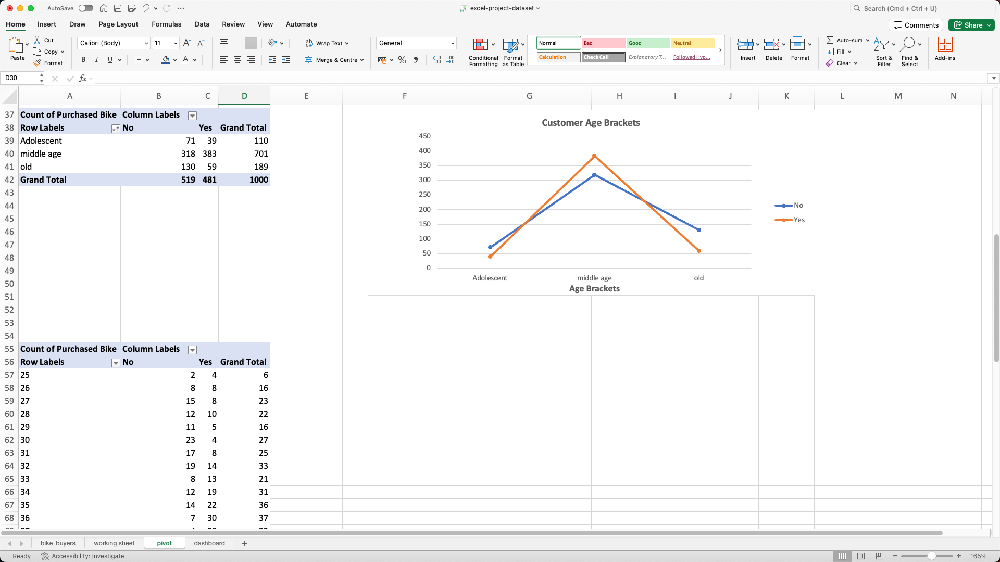
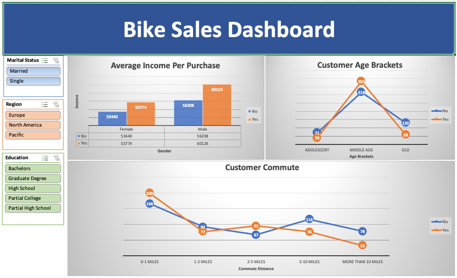

# Bike Buyers: Data Analysis with Excel

This project looks at who buys bikes and why. I used Excel to clean the data, build pivot tables, and put together an interactive dashboard so we can slice by marital status, region, and education.

---

## Project Overview

The goal was to find patterns between customer attributes (income, gender, age, commute distance, education, region, marital status) and whether they bought a bike. We get cleaned data, pivot-table analysis, and a dashboard we can use to explore and report. The takeaways point to which segments are more likely to buy, so we can focus targeting and messaging there.

---

## Dataset

**Source:** [Excel Project Dataset](https://github.com/AlexTheAnalyst/Excel-Tutorial/blob/main/Excel%20Project%20Dataset.xlsx) (Alex The Analyst - Excel Tutorial)

**File in repo:** `excel-project-dataset.xlsx`

| Column             | Description                                                                        |
|--------------------|------------------------------------------------------------------------------------|
| ID                 | Unique customer identifier                                                         |
| Marital Status     | Married / Single                                                                   |
| Gender             | Male / Female                                                                      |
| Income             | Customer income                                                                    |
| Children           | Number of children                                                                 |
| Education          | e.g. Bachelors, Graduate Degree, High School, Partial College, Partial High School |
| Occupation         | e.g. Clerical, Management, Manual, Professional, Skilled Manual                    |
| Home Owner         | Yes / No                                                                           |
| Cars               | Number of cars                                                                     |
| Commute Distance   | e.g. 0-1 Miles, 1-2 Miles, 2-5 Miles, 5-10 Miles, 10+ Miles                        |
| Region             | Europe, North America, Pacific                                                     |
| Age                | Customer age                                                                       |
| **Purchased Bike** | Yes / No (target outcome)                                                          |

---

## What I Did

I cleaned and standardized the data on a working sheet: I removed duplicates first, then fixed consistent categories and blanks so the pivots and charts would be reliable. Most of my work went into pivot tables: aggregating by dimensions like Gender, Commute Distance, and Age brackets, comparing Purchased Bike (Yes vs No) across segments, and pulling out metrics like Average of Income and Count of Purchased Bike. Those pivots drive the bar and line charts. I built a single-page Bike Sales Dashboard with slicers (Marital Status, Region, Education) and three charts (Average Income by Purchase, Customer Age Brackets, and Customer Commute), all connected to the same data so the dashboard stays interactive.

---

## Workbook Structure

| Sheet             | Purpose                                       |
|-------------------|-----------------------------------------------|
| **bike_buyers**   | Raw/source data                               |
| **working sheet** | Data cleaning and preparation                 |
| **pivot**         | Pivot tables and supporting charts            |
| **dashboard**     | Interactive dashboard with slicers and charts |

---

## Key Insights

Customers who bought a bike tend to have higher average income (e.g. male purchasers around 60k vs non-purchasers around 56k; same pattern for females). Middle-age customers account for the most bike purchasers; adolescent and older segments have fewer. Shorter commutes (0–1 miles, 2–5 miles) go with more purchases; longer commutes (5–10 miles, 10+ miles) have fewer. That suggests focusing on middle-age, higher-income, shorter-commute segments when targeting.

---

## Screenshots

**Pivot tables and charts**

**Bike Sales Dashboard**

---

## Tools & Skills

Excel for data cleaning, pivot tables, pivot charts, slicers, and dashboard layout. The work involves aggregation, segmentation, and comparing proportions and averages, plus bar/line charts and a simple dashboard layout for sharing with stakeholders.

---

## Resources

- **Tutorial:** [Full Project in Excel \| Excel Tutorials for Beginners](https://youtu.be/opJgMj1IUrc?si=M7czkmxHVat-Bsld) - Alex The Analyst  
- **Dataset:** [Excel Project Dataset.xlsx](https://github.com/AlexTheAnalyst/Excel-Tutorial/blob/main/Excel%20Project%20Dataset.xlsx) - Alex The Analyst / Excel-Tutorial
